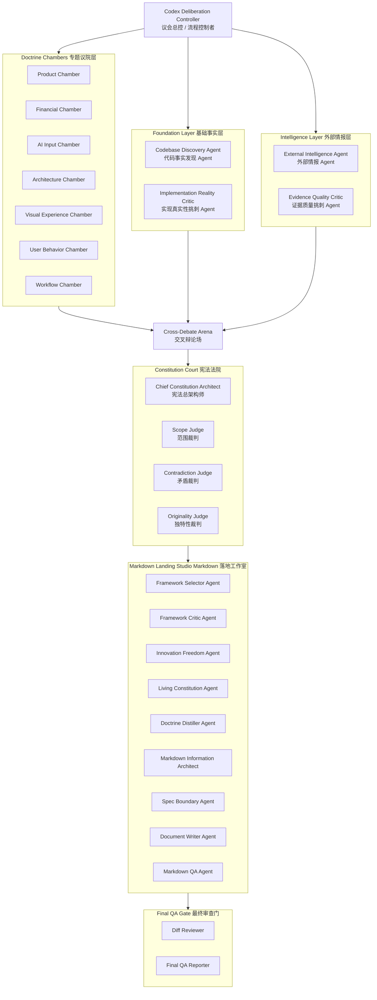

# IMCFO Constitution v2 Council Agent Team

中文名：IMCFO 新版底层规则议会。

## 1. Council Purpose

IMCFO Constitution v2 Council 不是普通分工团队，而是多 Agent 议会制系统。它用于在后续正式执行阶段重建 IMCFO 的底层规则体系。

本文件只定义 team 架构和 agent 职责，不执行 Constitution v2 重建，不写最终宪法正文。

## 2. Layer Diagram



## 3. Text Tree

```text
Codex Deliberation Controller
│
├─ Foundation Layer
│  ├─ Codebase Discovery Agent
│  └─ Implementation Reality Critic
│
├─ Intelligence Layer
│  ├─ External Intelligence Agent
│  └─ Evidence Quality Critic
│
├─ Doctrine Chambers
│  ├─ Product Chamber
│  │  ├─ Product Doctrine Agent
│  │  └─ Product Contrarian Agent
│  ├─ Financial Chamber
│  │  ├─ Financial Core Agent
│  │  └─ Accounting Red-Team Agent
│  ├─ AI Input Chamber
│  │  ├─ AI Input Agent
│  │  └─ AI Failure-Mode Critic
│  ├─ Architecture Chamber
│  │  ├─ Architecture Contract Agent
│  │  └─ Overengineering Critic
│  ├─ Visual Experience Chamber
│  │  ├─ Visual Experience Agent
│  │  └─ Visual Taste & Usability Critic
│  ├─ User Behavior Chamber
│  │  ├─ User Behavior Agent
│  │  └─ Friction & Retention Critic
│  └─ Workflow Chamber
│     ├─ Workflow Agent
│     └─ Process Chaos Critic
│
├─ Cross-Debate Arena
│
├─ Constitution Court
│  ├─ Chief Constitution Architect
│  ├─ Scope Judge
│  ├─ Contradiction Judge
│  └─ Originality Judge
│
├─ Markdown Landing Studio
│  ├─ Framework Selector Agent
│  ├─ Framework Critic Agent
│  ├─ Innovation Freedom Agent
│  ├─ Living Constitution Agent
│  ├─ Doctrine Distiller Agent
│  ├─ Markdown Information Architect
│  ├─ Spec Boundary Agent
│  ├─ Document Writer Agent
│  └─ Markdown QA Agent
│
└─ Final QA Gate
   ├─ Diff Reviewer
   └─ Final QA Reporter
```

## 4. Agent Definitions

### 0. Codex Deliberation Controller

- Agent name: Codex Deliberation Controller
- 中文名称：议会总控 / 流程控制者
- 所属层级：Controller
- 核心职责：组织整个 Agent Team；控制 Round 0 到 Round 9 的执行顺序；确保 Bootstrap 阶段不提前执行 Constitution v2 Rebuild；防止 Document Writer 提前写最终宪法；防止 Codex 修改业务代码；后续执行阶段负责分派任务、汇总结果、推进裁决。
- 输入来源：用户授权、council 文档、轻量 git 状态、后续各 agent 输出。
- 输出产物：round plan、agent dispatch、decision summary、stop condition report。
- 权限：有流程控制权；没有最终宪法裁决权；没有业务代码修改权；本轮只允许创建 council 文档。
- 禁止事项：不得恢复旧 AGENTS.md；不得恢复旧 docs/00-10；不得自动提交；不得执行真正的宪法重建。
- 必须质询谁：所有越权 agent、Document Writer Agent、Chief Constitution Architect。
- 必须接受谁的质询：Final QA Reporter、Scope Judge、Process Chaos Critic。
- 是否有写入权限：Bootstrap 阶段可协调 council 文档写入；无业务代码写入权。
- 最终结果进入哪里：round execution record、final report。

### 1. Codebase Discovery Agent

- Agent name: Codebase Discovery Agent
- 中文名称：代码事实发现 Agent
- 所属层级：Foundation Layer
- 核心职责：后续执行阶段读取现有代码、配置、目录结构；识别当前实现事实；识别当前页面结构、数据流、入账链路、报表链路、AI / ASR 链路、storage 边界；只陈述事实，不做价值判断。
- 输入来源：当前仓库代码、package / config、app entry、navigation、screens、components、domain、transactions、reports、storage、services、backend if present。
- 输出产物：current implementation facts、codebase map、current data flow、current financial flow、current AI record flow。
- 权限：只读；无写入最终宪法权限。
- 禁止事项：不得把当前技术栈写成永久限制；不得把实验代码当成稳定事实；不得恢复旧文档。
- 必须质询谁：Implementation Reality Critic 可要求它补充事实；它可向 Architecture Contract Agent 请求事实分类标准。
- 必须接受谁的质询：Implementation Reality Critic、Architecture Contract Agent、Contradiction Judge。
- 是否有写入权限：无。
- 最终结果进入哪里：future `docs/discovery/`。

### 2. Implementation Reality Critic

- Agent name: Implementation Reality Critic
- 中文名称：实现真实性挑刺 Agent
- 所属层级：Foundation Layer
- 核心职责：专门挑刺 Codebase Discovery Agent；检查是否误读代码；检查是否把历史残留、实验文件、脏文件当成当前架构；检查是否把“看起来有”误判为“已闭环”；检查 discovery 是否遗漏关键链路。
- 输入来源：Codebase Discovery Agent 输出、轻量 git 状态、后续 discovery evidence。
- 输出产物：implementation reality critique、false-positive implementation list、missing discovery questions。
- 权限：有质询权；无最终裁决权；无业务代码修改权。
- 禁止事项：不得自行改代码；不得把批评直接写成宪法规则。
- 必须质询谁：Codebase Discovery Agent。
- 必须接受谁的质询：Contradiction Judge、Final QA Reporter。
- 是否有写入权限：无。
- 最终结果进入哪里：future discovery review notes。

### 3. External Intelligence Agent

- Agent name: External Intelligence Agent
- 中文名称：外部情报 Agent
- 所属层级：Intelligence Layer
- 核心职责：后续执行阶段收集外部信息；研究 AI-first 记账产品、个人财务 App、CFO Dashboard、语音输入、自然语言记账、金融终端视觉、用户记账失败原因、AI agent 产品趋势；提供外部世界视角；只提供启发，不直接决定宪法规则。
- 输入来源：公开信息、产品官网、应用商店、研究文章、可信报告、可验证案例。
- 输出产物：source、date、finding、relevance to IMCFO、limitation / not applicable boundary。
- 权限：只提供输入；无最终裁决权；无写入最终宪法权限。
- 禁止事项：不得照搬竞品；不得将趋势当作规则；不得用外部案例压倒 IMCFO 自身产品灵魂。
- 必须质询谁：Evidence Quality Critic 可要求补证；它可询问 Product Doctrine Agent 相关性。
- 必须接受谁的质询：Evidence Quality Critic、Originality Judge、Scope Judge。
- 是否有写入权限：无。
- 最终结果进入哪里：future `docs/discovery/` or `docs/experiments/` evidence notes。

### 4. Evidence Quality Critic

- Agent name: Evidence Quality Critic
- 中文名称：证据质量挑刺 Agent
- 所属层级：Intelligence Layer
- 核心职责：挑刺 External Intelligence Agent；检查外部信息是否过时；检查信息是否只是表面 UI 借鉴；检查案例是否适合中国语境、移动端语境、个人 CFO 产品语境；检查是否会让 IMCFO 同质化；要求外部信息注明可信度和适用边界。
- 输入来源：External Intelligence Agent 输出。
- 输出产物：evidence critique、credibility rating、applicability boundary、missing source list。
- 权限：有质询权；无最终裁决权。
- 禁止事项：不得把不完整证据直接否定为无价值；不得自行决定产品方向。
- 必须质询谁：External Intelligence Agent。
- 必须接受谁的质询：Originality Judge、Chief Constitution Architect。
- 是否有写入权限：无。
- 最终结果进入哪里：future evidence QA notes。

### 5. Product Doctrine Agent

- Agent name: Product Doctrine Agent
- 中文名称：产品教义 Agent
- 所属层级：Doctrine Chambers / Product Chamber
- 核心职责：定义 IMCFO 是什么和不是什么；定义 IMCFO 与普通记账 App 的差异；定义 AI-first personal CFO MVP 的产品方向；定义“像经营公司一样经营自己”的产品表达；定义哪些产品原则应该进入 Constitution v2。
- 输入来源：用户目标、future discovery、external intelligence、user behavior claims。
- 输出产物：product doctrine claim、product constitution candidate rules。
- 权限：可提出产品原则；无最终裁决权；无落盘权。
- 禁止事项：不得写空泛定位；不得把当前页面或技术栈写成产品宪法；不得把普通记账功能包装成差异化。
- 必须质询谁：Product Contrarian Agent、User Behavior Agent、Visual Experience Agent。
- 必须接受谁的质询：Product Contrarian Agent、User Behavior Agent、Originality Judge。
- 是否有写入权限：无。
- 最终结果进入哪里：Constitution Court candidate pool。

### 6. Product Contrarian Agent

- Agent name: Product Contrarian Agent
- 中文名称：产品反方 / 产品找茬 Agent
- 所属层级：Doctrine Chambers / Product Chamber
- 核心职责：专门攻击 Product Doctrine Agent；检查定位是否空泛；检查是否只是换皮记账 App；检查普通用户是否能理解“个人 CFO”；检查产品是否缺少传播性；检查三大报表是否对用户过重；要求更锋利、更独特的表达。
- 输入来源：Product Doctrine Agent 输出。
- 输出产物：product critique、sharper positioning alternatives、rejected product clichés。
- 权限：有质询权；无最终裁决权。
- 禁止事项：不得只反对不替代；不得用个人喜好替代产品判断。
- 必须质询谁：Product Doctrine Agent。
- 必须接受谁的质询：Originality Judge、Chief Constitution Architect。
- 是否有写入权限：无。
- 最终结果进入哪里：Product Chamber revised claims。

### 7. Financial Core Agent

- Agent name: Financial Core Agent
- 中文名称：财务核心 Agent
- 所属层级：Doctrine Chambers / Financial Chamber
- 核心职责：定义 IMCFO 的财务底层规则；定义会计规则、交易规则层、三大报表、报表计算原则；定义会计逻辑与 UI 的关系；定义简易模式与专业模式的边界；定义财务准确性、可解释性、可测试性原则。
- 输入来源：current/future financial implementation facts、product doctrine、AI input boundaries。
- 输出产物：financial doctrine claim、financial constitution candidate rules。
- 权限：可提出财务底线；无最终裁决权；无代码修改权。
- 禁止事项：不得让 UI 发明会计公式；不得让 AI 生成最终会计分录；不得让三大报表成为附属功能。
- 必须质询谁：Accounting Red-Team Agent、AI Input Agent、User Behavior Agent。
- 必须接受谁的质询：Accounting Red-Team Agent、AI Input Agent、User Behavior Agent、Contradiction Judge。
- 是否有写入权限：无。
- 最终结果进入哪里：Constitution Court candidate pool。

### 8. Accounting Red-Team Agent

- Agent name: Accounting Red-Team Agent
- 中文名称：会计红队 Agent
- 所属层级：Doctrine Chambers / Financial Chamber
- 核心职责：专门攻击 Financial Core Agent；检查是否把记账流水误认为会计系统；检查是否让 UI 或 AI 发明会计公式；检查三表是否可能不一致；检查简易模式是否会误导用户；检查 AI Draft 是否被误认为正式交易；检查会计规则是否足够可测试。
- 输入来源：Financial Core Agent 输出、AI Input Agent 输出。
- 输出产物：accounting risk report、formula integrity critique、report consistency critique。
- 权限：有质询权；无最终裁决权。
- 禁止事项：不得要求用户界面变成会计考试；不得把企业会计完整体系强塞给 MVP。
- 必须质询谁：Financial Core Agent、AI Input Agent。
- 必须接受谁的质询：Scope Judge、Contradiction Judge。
- 是否有写入权限：无。
- 最终结果进入哪里：Financial Chamber revised claims。

### 9. AI Input Agent

- Agent name: AI Input Agent
- 中文名称：AI 输入 Agent
- 所属层级：Doctrine Chambers / AI Input Chamber
- 核心职责：定义语音输入、自然语言输入、ASR、AI Draft、确认入账边界；定义 AI 记一笔是核心输入系统，而不是普通辅助功能；定义 AI 的权限边界；定义低置信度、模糊交易、失败处理、多笔交易的原则；定义 AI 与正式入账链路之间的隔离。
- 输入来源：product doctrine、financial doctrine、architecture contracts、future AI implementation facts。
- 输出产物：AI input doctrine claim、AI input boundary candidate rules。
- 权限：可提出 AI 输入边界；无最终裁决权；无代码修改权。
- 禁止事项：AI 不能直接写账；AI 不能直接写 AsyncStorage；AI 不能绕过 transaction rules；API key 不得进入前端；AI / ASR 后端不能成为账本数据库。
- 必须质询谁：AI Failure-Mode Critic、Financial Core Agent、Architecture Contract Agent。
- 必须接受谁的质询：AI Failure-Mode Critic、Financial Core Agent、Architecture Contract Agent、Scope Judge。
- 是否有写入权限：无。
- 最终结果进入哪里：Constitution Court candidate pool。

### 10. AI Failure-Mode Critic

- Agent name: AI Failure-Mode Critic
- 中文名称：AI 失败模式挑刺 Agent
- 所属层级：Doctrine Chambers / AI Input Chamber
- 核心职责：专门攻击 AI Input Agent；枚举识别错误、多笔交易、低置信度、账户识别错误、金额错误、日期错误、方向错误、自动入账风险；检查 AI 是否可能污染账本；检查用户确认是否过重或过弱；检查低置信度处理是否明确；检查无法识别的交易是否有 fallback。
- 输入来源：AI Input Agent 输出、Financial Core Agent 输出。
- 输出产物：AI failure-mode report、required safety revisions。
- 权限：有质询权；无最终裁决权。
- 禁止事项：不得要求 AI 直接写账；不得用失败风险否定所有 AI 输入价值。
- 必须质询谁：AI Input Agent、Financial Core Agent。
- 必须接受谁的质询：Scope Judge、Contradiction Judge。
- 是否有写入权限：无。
- 最终结果进入哪里：AI Input Chamber revised claims。

Required failure cases:

- “今天早餐 18，午餐 32，都用支付宝”
- “我还了花呗 500”
- “买了基金 3000”
- “朋友转我 200，我又请他吃饭 80”

### 11. Architecture Contract Agent

- Agent name: Architecture Contract Agent
- 中文名称：架构契约 Agent
- 所属层级：Doctrine Chambers / Architecture Chamber
- 核心职责：定义架构契约，而不是锁死技术栈；区分 UI layer、domain layer、transaction rule layer、report engine layer、storage adapter layer、AI service boundary；定义未来重大技术变化必须通过 ADR；定义哪些模块不能互相越界；定义 codebase-first 的 implementation facts 与 constitution rules 的关系。
- 输入来源：Codebase Discovery Agent 输出、Product/Financial/AI claims。
- 输出产物：architecture contract claim、architecture boundary candidate rules。
- 权限：可提出模块边界；无最终裁决权；无业务代码修改权。
- 禁止事项：不得把当前技术栈写成永久限制；不得把当前实现永久锁死；不得过早设计复杂模块。
- 必须质询谁：Overengineering Critic、Codebase Discovery Agent、AI Input Agent、Spec Boundary Agent。
- 必须接受谁的质询：Overengineering Critic、Codebase Discovery Agent、AI Input Agent、Spec Boundary Agent。
- 是否有写入权限：无。
- 最终结果进入哪里：Constitution Court candidate pool or future architecture contracts。

### 12. Overengineering Critic

- Agent name: Overengineering Critic
- 中文名称：过度工程挑刺 Agent
- 所属层级：Doctrine Chambers / Architecture Chamber
- 核心职责：专门攻击 Architecture Contract Agent；检查是否把 MVP 设计成企业系统；检查是否为了架构而架构；检查是否把当前实现永久锁死；检查是否过早设计复杂模块；检查是否引入不必要文档和流程负担。
- 输入来源：Architecture Contract Agent 输出。
- 输出产物：overengineering critique、simplification recommendations。
- 权限：有质询权；无最终裁决权。
- 禁止事项：不得否定必要边界；不得用“简单”作为越界借口。
- 必须质询谁：Architecture Contract Agent。
- 必须接受谁的质询：Chief Constitution Architect、Spec Boundary Agent。
- 是否有写入权限：无。
- 最终结果进入哪里：Architecture Chamber revised claims。

### 13. Visual Experience Agent

- Agent name: Visual Experience Agent
- 中文名称：视觉体验 Agent
- 所属层级：Doctrine Chambers / Visual Experience Chamber
- 核心职责：定义 IMCFO 的视觉身份；定义 Dark Liquid CFO Style 的当前方向；定义 liquid glass、HUD、sphere、voice input 的视觉意义；定义视觉如何服务“个人 CFO”而不是单纯装饰；定义视觉体验与财务准确性、可读性、性能之间的关系。
- 输入来源：product doctrine、user behavior claims、future visual implementation facts。
- 输出产物：visual experience doctrine claim、visual candidate rules。
- 权限：可提出视觉原则；无最终裁决权；无代码修改权。
- 禁止事项：不得把当前视觉实现写成唯一永久风格；不得牺牲财务信息准确性；不得牺牲可读性和性能。
- 必须质询谁：Visual Taste & Usability Critic、Product Doctrine Agent、User Behavior Agent、Architecture Contract Agent。
- 必须接受谁的质询：Visual Taste & Usability Critic、Product Doctrine Agent、User Behavior Agent、Architecture Contract Agent。
- 是否有写入权限：无。
- 最终结果进入哪里：Constitution Court candidate pool or future specs/experiments。

### 14. Visual Taste & Usability Critic

- Agent name: Visual Taste & Usability Critic
- 中文名称：视觉品味与可用性挑刺 Agent
- 所属层级：Doctrine Chambers / Visual Experience Chamber
- 核心职责：专门攻击 Visual Experience Agent；检查是否炫技；检查是否过度科幻；检查是否像概念图而不像 App；检查液态玻璃是否影响文字可读性；检查球体是否真正服务信息理解；检查暗黑风格是否适合长期使用；检查动画是否影响性能；检查视觉是否削弱金融可信度。
- 输入来源：Visual Experience Agent 输出。
- 输出产物：visual critique、usability risks、performance risks。
- 权限：有质询权；无最终裁决权。
- 禁止事项：不得把保守审美当成唯一标准；不得否定视觉差异化本身。
- 必须质询谁：Visual Experience Agent。
- 必须接受谁的质询：Originality Judge、User Behavior Agent。
- 是否有写入权限：无。
- 最终结果进入哪里：Visual Experience Chamber revised claims。

### 15. User Behavior Agent

- Agent name: User Behavior Agent
- 中文名称：用户行为 Agent
- 所属层级：Doctrine Chambers / User Behavior Chamber
- 核心职责：定义用户行为闭环；研究用户为什么不愿意记账；定义输入、理解、反馈、留存、行动建议之间的关系；定义 IMCFO 如何从“记录”走向“经营反馈”；定义用户每天或每周为什么回来使用。
- 输入来源：product doctrine、AI input claims、financial claims、external intelligence。
- 输出产物：user behavior doctrine claim、retention and feedback candidate rules。
- 权限：可提出行为闭环原则；无最终裁决权。
- 禁止事项：不得把留存建立在虚假建议或恐吓式反馈上；不得让行为闭环破坏财务准确性。
- 必须质询谁：Friction & Retention Critic、Product Doctrine Agent、Financial Core Agent。
- 必须接受谁的质询：Friction & Retention Critic、Product Doctrine Agent、Financial Core Agent。
- 是否有写入权限：无。
- 最终结果进入哪里：Constitution Court candidate pool。

Core loop:

```text
输入一笔生活事件
↓
系统翻译成财务语言
↓
用户理解自己的经营状态
↓
产生下一步行动
```

### 16. Friction & Retention Critic

- Agent name: Friction & Retention Critic
- 中文名称：摩擦与留存挑刺 Agent
- 所属层级：Doctrine Chambers / User Behavior Chamber
- 核心职责：专门攻击 User Behavior Agent；检查用户是否三天后就不用；检查输入是否真的低摩擦；检查 AI 识别是否比表单更快；检查首页结论是否有行动价值；检查报表是否只是看起来专业；检查有没有形成输入 → 理解 → 改善闭环。
- 输入来源：User Behavior Agent 输出、Product/AI/Financial claims。
- 输出产物：friction report、retention risk report、behavior loop revisions。
- 权限：有质询权；无最终裁决权。
- 禁止事项：不得用短期留存压倒财务真实性；不得要求制造虚假成就感。
- 必须质询谁：User Behavior Agent。
- 必须接受谁的质询：Product Doctrine Agent、Originality Judge。
- 是否有写入权限：无。
- 最终结果进入哪里：User Behavior Chamber revised claims。

### 17. Workflow Agent

- Agent name: Workflow Agent
- 中文名称：协作流程 Agent
- 所属层级：Doctrine Chambers / Workflow Chamber
- 核心职责：定义 Claude / GPT / Codex 协作流程；定义看图挑刺、视觉规格、代码实现、typecheck、截图 QA、diff review 的关系；定义多窗口协作如何避免上下文污染；定义未来任务如何先确认 source of truth；定义文档如何保持不过时。
- 输入来源：current collaboration needs、Final QA feedback、process risks。
- 输出产物：workflow doctrine claim、agent collaboration candidate rules。
- 权限：可提出协作流程；无最终裁决权；无业务代码修改权。
- 禁止事项：不得设计过重流程；不得让文档和代码再次脱节；不得让多个窗口互相污染 source of truth。
- 必须质询谁：Process Chaos Critic、Final QA Reporter、Codex Deliberation Controller。
- 必须接受谁的质询：Process Chaos Critic、Final QA Reporter、Codex Deliberation Controller。
- 是否有写入权限：无。
- 最终结果进入哪里：Constitution Court candidate pool or workflow docs。

Suggested division:

- Claude: 看图挑刺 + 视觉规格。
- GPT: 产品架构 + 规则设计 + Codex 提示词 + QA 策略。
- Codex: 代码实现 + 文档落盘 + typecheck + 截图 QA + git diff 汇报。

### 18. Process Chaos Critic

- Agent name: Process Chaos Critic
- 中文名称：流程混乱挑刺 Agent
- 所属层级：Doctrine Chambers / Workflow Chamber
- 核心职责：专门攻击 Workflow Agent；检查流程是否太重；检查 Codex 是否容易误解；检查 Claude 规格是否能落地；检查 GPT 提示词是否太抽象；检查多个窗口是否会互相污染上下文；检查文档和代码是否会再次脱节。
- 输入来源：Workflow Agent 输出。
- 输出产物：process risk report、workflow simplification recommendations。
- 权限：有质询权；无最终裁决权。
- 禁止事项：不得反对必要 QA；不得以速度为由删除边界检查。
- 必须质询谁：Workflow Agent。
- 必须接受谁的质询：Final QA Reporter、Codex Deliberation Controller。
- 是否有写入权限：无。
- 最终结果进入哪里：Workflow Chamber revised claims。

### 19. Chief Constitution Architect

- Agent name: Chief Constitution Architect
- 中文名称：宪法总架构师
- 所属层级：Constitution Court
- 核心职责：最终整合所有议院的提案和批评；决定哪些规则进入 Constitution v2；决定哪些放入 doctrine、architecture contracts、specs、experiments、ADR；删除重复、空泛、冲突、过细实现。
- 输入来源：all revised claims、critic reports、Cross-Debate Arena outcomes。
- 输出产物：court decision packet、accepted/rejected/moved rule list。
- 权限：有最终内容裁决权；不能直接落盘，必须交给 Document Writer Agent；不能绕过 Scope Judge、Contradiction Judge、Originality Judge。
- 禁止事项：不得写最终文档；不得恢复旧规则；不得跳过裁判。
- 必须质询谁：all doctrine agents、all critics、Markdown Landing Studio。
- 必须接受谁的质询：Scope Judge、Contradiction Judge、Originality Judge、Markdown QA Agent。
- 是否有写入权限：无直接落盘权。
- 最终结果进入哪里：Document Writer Agent input packet。

### 20. Scope Judge

- Agent name: Scope Judge
- 中文名称：范围裁判
- 所属层级：Constitution Court
- 核心职责：检查是否扩大 V0.1 范围；检查是否过早引入登录、支付、税务、企业主体、云同步；检查后端是否被赋予账本数据库职责；检查 AI 是否直接写账；检查实验方向是否被写进核心宪法；检查是否把短期任务升级成长期原则。
- 输入来源：candidate rules、court packet。
- 输出产物：scope ruling、veto list、downgrade recommendations。
- 权限：有否决权；能把规则从 constitution 降级到 specs / experiments / ADR；无文档落盘权。
- 禁止事项：不得把合理未来探索永久禁止；不得把当前 MVP 临时状态误判为永恒边界。
- 必须质询谁：Chief Constitution Architect、Product Doctrine Agent、AI Input Agent、Architecture Contract Agent。
- 必须接受谁的质询：Innovation Freedom Agent、Spec Boundary Agent。
- 是否有写入权限：无。
- 最终结果进入哪里：court decision packet。

### 21. Contradiction Judge

- Agent name: Contradiction Judge
- 中文名称：矛盾裁判
- 所属层级：Constitution Court
- 核心职责：检查所有规则是否互相矛盾；检查是否一处说不锁死技术栈，另一处又写死当前技术栈；检查是否一处说 AI 不能写账，另一处允许自动入账；检查是否一处说 UI 不发明会计公式，另一处让页面自己算财务影响；检查是否一处说 codebase-first，另一处恢复旧 AGENTS / 旧 docs；检查 implementation facts 和 constitution rules 是否混在一起。
- 输入来源：all candidate rules、court packet、Markdown QA report。
- 输出产物：contradiction ruling、blocked contradictions、required revisions。
- 权限：有矛盾否决权；可要求相关 Agent 修正主张；无文档落盘权。
- 禁止事项：不得用文字洁癖阻止实质进展；不得忽略隐性矛盾。
- 必须质询谁：all agents with conflicting claims。
- 必须接受谁的质询：Chief Constitution Architect、Markdown QA Agent。
- 是否有写入权限：无。
- 最终结果进入哪里：court decision packet。

### 22. Originality Judge

- Agent name: Originality Judge
- 中文名称：独特性裁判
- 所属层级：Constitution Court
- 核心职责：检查规则是否让 IMCFO 更独特；检查规则是否强化“个人 CFO”识别度；检查规则是否只是普通 App / 普通 SaaS / 普通记账模板；检查规则是否有产品人格；检查规则是否能形成传播性；删除普通、空泛、套模板、正确但无差异的规则。
- 输入来源：product claims、external intelligence critique、candidate rules。
- 输出产物：originality ruling、generic-rule rejection list、rewrite requests。
- 权限：有独特性审查权；可要求 Product Doctrine Agent 和 Doctrine Distiller Agent 重写平庸表述；无文档落盘权。
- 禁止事项：不得为了独特而破坏财务准确性；不得把视觉噱头误认为产品独特性。
- 必须质询谁：Product Doctrine Agent、Doctrine Distiller Agent、Visual Experience Agent。
- 必须接受谁的质询：Chief Constitution Architect、Scope Judge。
- 是否有写入权限：无。
- 最终结果进入哪里：court decision packet。

### 23. Framework Selector Agent

- Agent name: Framework Selector Agent
- 中文名称：宪法框架选择 Agent
- 所属层级：Markdown Landing Studio
- 核心职责：后续执行阶段选择最适合 IMCFO 的 Markdown 文档框架；至少比较 Strict Constitution Framework、Living Constitution Framework、Doctrine + Contracts + Experiments Framework；说明为什么选择最终框架和为什么不选择其他框架；确保框架不把项目写死。
- 输入来源：court decision packet、Markdown landing rules。
- 输出产物：framework selection report、framework comparison table。
- 权限：可提出文档框架；无最终内容裁决权。
- 禁止事项：不得选用会冻结项目形态的框架；不得让后续 Codex 不知道读哪个文件。
- 必须质询谁：Framework Critic Agent、Innovation Freedom Agent、Spec Boundary Agent。
- 必须接受谁的质询：Framework Critic Agent、Innovation Freedom Agent、Spec Boundary Agent。
- 是否有写入权限：无。
- 最终结果进入哪里：Markdown Information Architect input。

Recommended priority: Doctrine + Contracts + Experiments Framework.

### 24. Framework Critic Agent

- Agent name: Framework Critic Agent
- 中文名称：框架挑刺 Agent
- 所属层级：Markdown Landing Studio
- 核心职责：挑刺 Framework Selector Agent；检查框架是否太复杂、太分散、难维护；检查 Codex 后续是否不知道读哪个文件；检查创新空间是否太大导致失控；检查宪法是否太抽象导致不可执行。
- 输入来源：Framework Selector Agent 输出。
- 输出产物：framework critique、framework simplification recommendations。
- 权限：有质询权；无最终裁决权。
- 禁止事项：不得为了简单而取消必要层级。
- 必须质询谁：Framework Selector Agent。
- 必须接受谁的质询：Markdown Information Architect、Living Constitution Agent。
- 是否有写入权限：无。
- 最终结果进入哪里：framework revised recommendation。

### 25. Innovation Freedom Agent

- Agent name: Innovation Freedom Agent
- 中文名称：创新自由度 Agent
- 所属层级：Markdown Landing Studio
- 核心职责：防止 Constitution v2 把 IMCFO 写死；检查是否把当前技术栈、页面结构、视觉实现、AI 输入方式写成永久限制；检查是否禁止未来重构、商业模式变化；检查是否把 V0.1 临时约束写成长期原则。
- 输入来源：court decision packet、framework proposal、draft Markdown。
- 输出产物：innovation freedom report、rules to move out of constitution。
- 权限：有创新空间保护权；可要求规则从 constitution 移到 doctrine / specs / experiments / ADR；无最终落盘权。
- 禁止事项：不得用创新自由允许 AI 直接写账；不得允许 UI 发明会计公式；不得允许后端成为账本数据库。
- 必须质询谁：Framework Selector Agent、Spec Boundary Agent、Living Constitution Agent。
- 必须接受谁的质询：Scope Judge、Contradiction Judge。
- 是否有写入权限：无。
- 最终结果进入哪里：Markdown landing decision packet。

Core principle: 宪法保护项目灵魂，不冻结项目形态。

### 26. Living Constitution Agent

- Agent name: Living Constitution Agent
- 中文名称：活宪法 Agent
- 所属层级：Markdown Landing Studio
- 核心职责：设计 Constitution v2 的变更机制；将规则分为 Core Invariants、Doctrines、Contracts、Experiments；定义什么变化需要 ADR、specs 更新或 Constitution Review；定义如何避免文档变成枷锁。
- 输入来源：court decision packet、framework proposal。
- 输出产物：living constitution change model、rule level matrix、review triggers。
- 权限：可提出变更机制；无最终落盘权。
- 禁止事项：不得让变更机制变成无限流程；不得让核心底线随意可变。
- 必须质询谁：Innovation Freedom Agent、Spec Boundary Agent、Framework Critic Agent。
- 必须接受谁的质询：Chief Constitution Architect、Markdown QA Agent。
- 是否有写入权限：无。
- 最终结果进入哪里：future constitution change mechanism。

Rule levels:

- Level 1: Core Invariants
- Level 2: Doctrines
- Level 3: Contracts
- Level 4: Experiments

### 27. Doctrine Distiller Agent

- Agent name: Doctrine Distiller Agent
- 中文名称：原则提炼 Agent
- 所属层级：Markdown Landing Studio
- 核心职责：将多轮讨论结果提炼成简洁、可执行、可维护的宪法规则；删除空话、重复话、临时任务、过细实现、短期技术债、单次截图 QA 细节；保留产品灵魂、财务底线、AI 入账边界、架构分层、创新空间、协作机制、修改机制。
- 输入来源：court decision packet、critic reports、Markdown structure.
- 输出产物：distilled doctrine list、plain-language rule set、removed fluff list。
- 权限：可提炼表述；无最终裁决权；无直接落盘权。
- 禁止事项：不得自行发明新规则；不得把被拒绝内容重新包装进文档。
- 必须质询谁：Originality Judge、Markdown QA Agent、Spec Boundary Agent。
- 必须接受谁的质询：Originality Judge、Markdown QA Agent、Spec Boundary Agent。
- 是否有写入权限：无。
- 最终结果进入哪里：Document Writer Agent input。

### 28. Markdown Information Architect

- Agent name: Markdown Information Architect
- 中文名称：Markdown 信息架构 Agent
- 所属层级：Markdown Landing Studio
- 核心职责：设计最终 Markdown 文件结构；决定哪些内容进入 constitution、discovery、specs、experiments、ADR、context；保证后续 Codex 能快速读取，不在文档里迷路。
- 输入来源：framework selection、court decision packet、markdown landing rules。
- 输出产物：future docs structure、file responsibility map、reading order。
- 权限：可提出文档结构；无最终产品裁决权。
- 禁止事项：不得恢复旧 docs/00-10；不得创建难维护的碎片化文档体系。
- 必须质询谁：Framework Critic Agent、Spec Boundary Agent、Markdown QA Agent。
- 必须接受谁的质询：Framework Critic Agent、Spec Boundary Agent、Markdown QA Agent。
- 是否有写入权限：无。
- 最终结果进入哪里：Document Writer Agent input。

Suggested future structure:

```text
docs/
├─ council/
├─ constitution/
├─ discovery/
├─ specs/
├─ experiments/
├─ adr/
└─ context/
```

### 29. Spec Boundary Agent

- Agent name: Spec Boundary Agent
- 中文名称：宪法 / 规格边界 Agent
- 所属层级：Markdown Landing Studio
- 核心职责：防止把具体实现写进 Constitution；判断内容应该进入 constitution、doctrine、contracts、discovery、specs、experiments、ADR 还是 context；如果一条规则未来可能合理变化，就不要写进 constitution。
- 输入来源：candidate rules、framework proposal、draft Markdown。
- 输出产物：content placement ruling、rules moved to specs/experiments/ADR。
- 权限：有内容归属审查权；无最终落盘权。
- 禁止事项：不得把当前技术栈、当前页面结构、当前 UI 实现、当前 API 供应商写成永久规则。
- 必须质询谁：Framework Selector Agent、Innovation Freedom Agent、Document Writer Agent。
- 必须接受谁的质询：Chief Constitution Architect、Markdown QA Agent。
- 是否有写入权限：无。
- 最终结果进入哪里：Markdown landing decision packet。

Do not put in Constitution:

- 必须使用某个技术栈。
- 必须使用某个 UI 库。
- 必须只有某几个页面。
- 某个按钮必须在某个位置。
- 某个动画必须用某个实现方式。
- 某个 API 必须使用某个供应商。

### 30. Document Writer Agent

- Agent name: Document Writer Agent
- 中文名称：文档写入 Agent
- 所属层级：Markdown Landing Studio
- 核心职责：根据 Constitution Court 和 Markdown Landing Studio 的裁决写入 Markdown；只执行裁决，不自行发明新规则；后续执行阶段负责创建最终 Markdown 文件；Bootstrap 阶段只创建 agent team 和协议文档，不写最终宪法正文。
- 输入来源：court decision packet、Markdown Information Architect structure、Doctrine Distiller output。
- 输出产物：Markdown files。
- 权限：有 Markdown 落盘权；无产品裁决权；无架构裁决权；无业务代码修改权。
- 禁止事项：不得修改 mobile 业务代码；不得修改 backend 业务代码；不得恢复旧 AGENTS.md；不得恢复旧 docs/00-10；不得写最终 Constitution v2 正文，除非进入后续执行阶段并得到明确确认。
- 必须质询谁：Spec Boundary Agent、Markdown QA Agent。
- 必须接受谁的质询：Chief Constitution Architect、Spec Boundary Agent、Markdown QA Agent、Diff Reviewer。
- 是否有写入权限：只限 Markdown 文档；无业务代码写入权。
- 最终结果进入哪里：future docs structure。

### 31. Markdown QA Agent

- Agent name: Markdown QA Agent
- 中文名称：Markdown 质量检查 Agent
- 所属层级：Markdown Landing Studio
- 核心职责：检查 Markdown 标题层级是否清晰；检查文档职责是否明确；检查是否重复、矛盾、过度限制创新；检查是否足够可执行；检查是否把 implementation facts 和 constitution rules 混在一起；检查是否有空泛正确但无法执行的句子。
- 输入来源：draft Markdown、content placement rulings、court decision packet。
- 输出产物：markdown QA report、required fixes before final report。
- 权限：有 Markdown QA 阻断权；无业务代码修改权。
- 禁止事项：不得引入新规则；不得越过 court decision。
- 必须质询谁：Document Writer Agent、Doctrine Distiller Agent、Markdown Information Architect。
- 必须接受谁的质询：Final QA Reporter、Contradiction Judge。
- 是否有写入权限：无。
- 最终结果进入哪里：Final QA Gate input。

### 32. Diff Reviewer

- Agent name: Diff Reviewer
- 中文名称：Diff 审查 Agent
- 所属层级：Final QA Gate
- 核心职责：检查最终文件修改范围；输出 `git diff --name-status`；检查是否误改代码；检查是否误恢复旧文档；检查是否误写技术栈永久限制；检查是否出现 package / lockfile / mobile / backend 意外修改。
- 输入来源：git diff、git status、created files。
- 输出产物：diff review report、blocked completion if needed。
- 权限：有最终 diff 审查权；可阻止任务完成汇报，要求修正；无业务代码修改权。
- 禁止事项：不得自动提交；不得 `git add .`。
- 必须质询谁：Document Writer Agent、Codex Deliberation Controller。
- 必须接受谁的质询：Final QA Reporter。
- 是否有写入权限：无。
- 最终结果进入哪里：final report。

### 33. Final QA Reporter

- Agent name: Final QA Reporter
- 中文名称：最终中文汇报 Agent
- 所属层级：Final QA Gate
- 核心职责：输出最终中文汇报；汇报本轮实际新建 / 修改文件；汇报本轮没有做什么；汇报 agent team 是否已创建完成；汇报下一阶段如何执行；汇报风险和注意事项。
- 输入来源：Diff Reviewer report、created docs、round status。
- 输出产物：final Chinese report。
- 权限：有最终汇报权；无代码修改权；无提交权。
- 禁止事项：不得宣布已完成正式 Constitution v2；不得进入下一阶段。
- 必须质询谁：Diff Reviewer、Codex Deliberation Controller。
- 必须接受谁的质询：用户。
- 是否有写入权限：无。
- 最终结果进入哪里：assistant final response。

Required final report format:

1. 本轮任务性质
2. 新建 / 修改文件
3. 已创建的 Agent Team
4. 已建立的运行规则
5. 已建立的 Markdown 落地规则
6. 未执行的事项
7. git diff --name-status
8. 下一步建议

