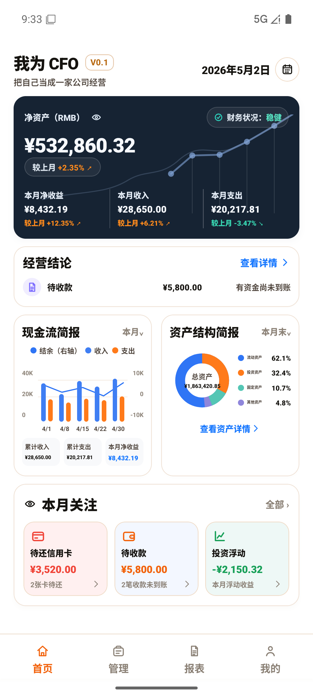
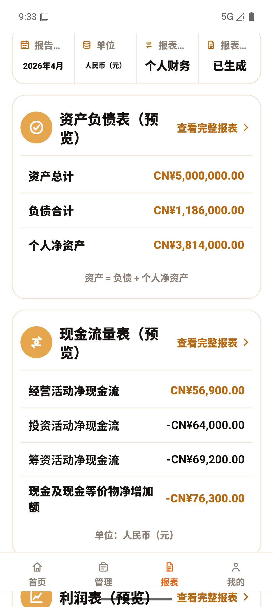
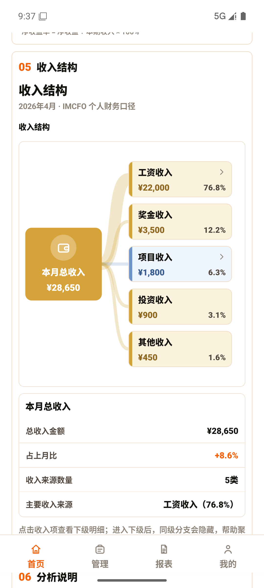
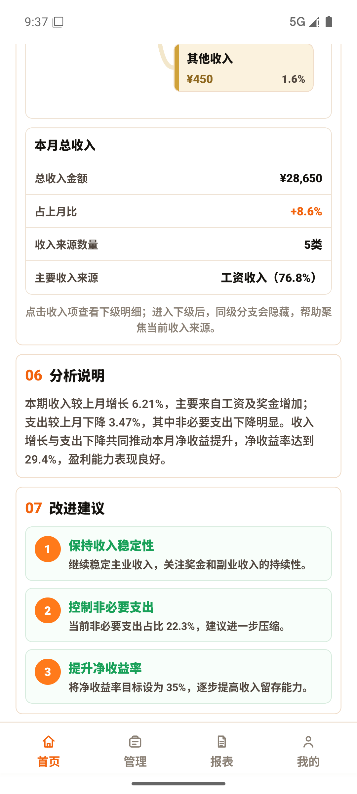
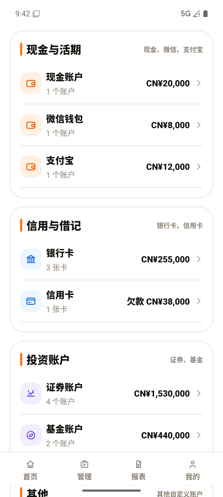
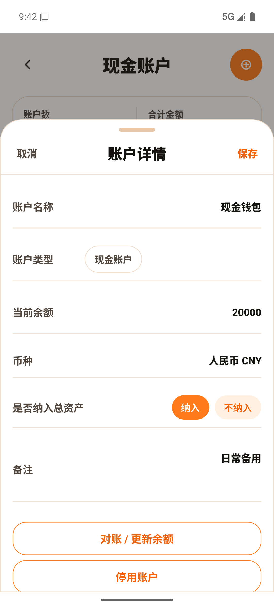

# 我为 CFO 当前项目完整交接包

生成日期：2026-05-04  
最近同步：2026-05-07  
项目根目录：`D:\imcfo`  
移动端目录：`D:\imcfo\mobile`  
当前分支：`wip/mobile-baseline-before-worktree`  
当前 HEAD：`a73b2bb docs: sync handoff package with wip baseline`  
`main` 当前指向：`759fb80 docs: sync handoff package with current progress`  
最低验证：`cd D:\imcfo\mobile; npm.cmd run typecheck` 已通过，2026-05-07。

## 1. 项目定位

“我为 CFO”不是普通记账 App。它把普通自然人的个人生活翻译成公司式财务报表，把用户视为一家“个人公司”，用资产负债表、利润表、现金流量表、经营结论和净资产视角帮助用户理解自己的财务经营状态。

一句话定位：

> 像经营公司一样经营自己。

V0.1 的用户是普通自然人，包括学生、刚毕业年轻人、普通职场人、有简单兼职或副业收入的人。V0.1 不服务个体工商户、企业主体、家庭合并账本、正式税务申报、开票经营、企业级财务系统或投资组合专业管理。

## 2. MVP 边界

当前 MVP 必须保持简单：

- 技术栈：Expo + React Native + TypeScript + AsyncStorage。
- 不新增后端、登录、数据库、云同步、真实 API、AI 分析、支付、会员、税务申报、VAT、发票、经营所得或个体工商户逻辑。
- 用户可见文案保持中文。
- 底部导航固定为：首页 / 管理 / 报表 / 我的。
- 简易版和专业版共享同一套数据和计算逻辑，只改变表达方式。
- UI 只能展示和收集输入，不能发明会计公式。

## 3. 底层架构

当前移动端架构是本地优先的 Expo 应用：

- `mobile/App.tsx`：应用壳、轻量路由、底部导航、页面间入口。
- `mobile/src/app/useAppData.ts`：数据入口，统一调用 storage adapter 和 domain 层规则。
- `mobile/src/storage/asyncStorageAdapter.ts`：AsyncStorage 持久化边界。
- `mobile/src/domain/models/*`：账户、资产、负债、交易、分录、报表期间和报表输出类型。
- `mobile/src/domain/accounting/*`：会计计算、交易规则、现金流规则、对账规则、期间过滤。
- `mobile/src/domain/reports/*`：三大报表和分析报告 view model。
- `mobile/src/domain/transactions/transactionDisplayIndex.ts`：交易记录展示索引。
- `mobile/src/screens/*`：页面展示和交互。
- `mobile/src/components/financeUI.tsx`：WIP 共享金融 UI primitives。
- `mobile/src/styles/theme.ts`：当前移动端视觉 token。后续视觉治理以 `docs/standards/imcfo-visual-system.md` 的“IMCFO 暗黑液态 CFO 风格”为准。

当前 WIP 分支还引入：

- `@shopify/react-native-skia`
- `expo-blur`
- `react-native-reanimated`
- `react-native-worklets`
- `mobile/assets/fonts/NotoSansSC-Regular.otf`
- `mobile/babel.config.js`

核心数据流：

```text
用户操作
  -> React Native Screen
  -> useAppData
  -> domain/accounting 规则或 report 纯计算
  -> storage adapter
  -> AsyncStorage
  -> useAppData 派生 summary
  -> Dashboard / Reports / Management UI
```

架构红线：

- 屏幕不直接调用 AsyncStorage。
- 报表计算函数必须是纯函数。
- 报表函数不依赖 React state。
- Storage adapter 不参与会计公式。
- UI 不临时修改现金流、利润、资产负债率等口径。

## 4. 会计设计

V0.1 使用个人经营语境下的六大会计要素：

- 资产
- 负债
- 所有者权益
- 收入
- 费用
- 利润

必须保持的核心公式：

- 所有者权益 = 资产 - 负债
- 利润 = 收入 - 费用
- 现金净变化 = 经营活动现金流 + 投资活动现金流 + 筹资活动现金流
- 资产负债率 = 总负债 / 总资产，总资产为 0 时不可计算
- 储蓄率 = 利润 / 收入，收入为 0 时不可计算

三大报表：

- 资产负债表：回答“我现在拥有多少，欠了多少，真正属于我的钱是多少？”
- 利润表：回答“我这个期间赚了还是亏了？”
- 现金流量表：回答“我的现金是怎么流进和流出的？”

当前三大报表 builder 主要来自 `mobile/src/domain/accounting/calculations.ts`，`mobile/src/domain/reports/balanceSheet.ts`、`incomeStatement.ts`、`cashFlowStatement.ts` 目前是 re-export。

## 5. 功能设计

当前核心闭环：

```text
首次建账 -> 录入资产负债 -> 记录收入费用和现金流 -> 首页看六要素
-> 查看三大报表 -> 管理账户/资产/负债 -> 持续记录和复盘
```

当前页面：

- 首页：净资产 hero、经营结论、现金流简报、资产结构简报、本月关注、钻取分析入口。
- 管理：自然语言记一笔、按钮记账、账务中心、账户/资产负债/交易入口。
- 交易记录：搜索、筛选、月份分组、交易详情。
- 账户管理：账户总览、账户分类详情、账户详情、新增/编辑、对账。
- 资产负债管理：资产/负债分段、会计科目列表、科目详情、明细详情、新增/编辑、对账、删除。
- 报表：资产负债表、利润表、现金流量表，支持简易版/专业版和完整报表面板。
- 经营分析报告：报告式分析页面，目前按静态 mock/prototype 看待。
- 盈利能力分析：指标表、趋势、收入结构下钻、说明弹层，目前按静态 mock/prototype 看待。
- 我的/设置：个人摘要、工具、设置、数据管理。

重要完成度说明：

- 三大基础报表和 Dashboard summary 基于当前本地数据计算。
- 经营分析报告和盈利能力分析页面目前不是完整真实报表引擎，`operatingAnalysisReport.ts` 和 `profitabilityAnalysis.ts` 仍不能宣传为真实业务分析完成。
- `incomeStructureFlow.ts` 是收入结构树到下钻 view model 的展示转换。
- Dashboard 内仍有部分趋势、结构和聚合逻辑留在 UI 层，后续应迁到 domain/report engine。

## 5.1 2026-05-05 进度同步

2026-05-05 的上下文快照记录了一轮 overnight-quality 维护审计，覆盖仓库结构、移动端入口、页面、组件、domain、hooks、storage、styles、TypeScript 编译稳定性、交易记录、筛选弹窗、月份折叠、交易详情、账户管理、资产负债管理、数据重置/导入后的状态安全。

关键修复方向：

- `TransactionRecordsScreen` 删除旧版交易搜索、筛选、分组和 display record 构建 helper，统一依赖 `transactionDisplayIndex`。
- `TransactionRecordsScreen` 在 records index 变化后清理已经不存在的交易详情选中项，避免重置、导入或清空数据后详情页引用 stale record。
- `transactionDisplayIndex` 移除关闭状态的性能调试 `console.log` 路径。
- 多个 screen/component 清理未使用导入、未使用状态和未使用组件。
- 交易记录默认懒加载月份数据仍保留，搜索或筛选时会 hydration 全量 records。

## 5.2 2026-05-07 WIP 基线同步

2026-05-07 的当前项目进度已经不在 `main` 上，而在 `wip/mobile-baseline-before-worktree` 分支上。该分支相对 `main` 多出两个 WIP 提交：

- `4ea401d wip: snapshot current mobile state before worktree`  
  记录大范围移动端基线：当时的金融 UI 基线、共享 `financeUI`、经营分析报告页面、盈利能力分析页面、收入结构下钻 view model、NotoSansSC 字体、Expo Babel 配置，以及 Skia/Blur/Reanimated/Worklets 依赖。当前正式视觉方向已升级为“IMCFO 暗黑液态 CFO 风格”。
- `4148dcb wip: snapshot current mobile state before worktree`  
  删除旧 Expo error log，并清理交易展示索引、交易记录页、账户管理页中的 stale detail/debug 风险。

当前分支状态在本次文档同步前是干净的：

```text
## wip/mobile-baseline-before-worktree
```

接管注意：

- 如果从 `main` 接管，会缺少 2026-05-07 WIP 移动端基线。
- 如果继续当前移动端实现，应从 `wip/mobile-baseline-before-worktree` 开始。
- 这两个提交是 WIP snapshot，不等于已经按最终功能边界拆分完成。
- 新增依赖应继续接受必要性审查，特别是静态 mock 报告页是否确实需要 Skia/Blur/Reanimated/Worklets。

2026-05-07 验证：

```powershell
cd D:\imcfo\mobile
npm.cmd run typecheck
```

结果：通过。

## 6. UI 设计

当前正式视觉方向是“IMCFO 暗黑液态 CFO 风格”，英文可称为 Dark Liquid CFO Style。

一句话定义：

> 深色金融操作台 + 液态玻璃卡片球体 + 赛博 HUD 数据流 + 个人 CFO AI 入口。

视觉定义：

> 以深色数字金融背景为底座，通过液态玻璃卡片、HUD 数据流、空间化财务球体和高对比财务语义色，构建一个 AI 时代的个人 CFO 操作系统。

旧的“暖色中国个人金融 + CFO 仪表盘”“橙色主色”“暖色金融视觉”不再作为唯一限制。橙色保留为品牌锚点、关键行动色和警示色之一；品牌表现色可以适度使用青蓝、水绿色、薄荷绿、紫蓝、电光紫、灰白、银白等数字金融色。

视觉结构：

- 首页、球体、智能记一笔、AI 输入入口和 HUD 可以使用深色金融背景、液态玻璃、发光边框、半透明卡片、空间层级、轻微流光、数据扫描线和球体旋转。
- 顶部 HUD 数据带用于展示收入、本月净收益、支出、经营状态等核心指标，必须服务财务状态感知，不能成为纯装饰。
- 中心液态玻璃财务球体由多张半透明功能节点卡片组成，可代表账户、资产、负债、收入、支出、报表、记一笔等功能节点。
- 管理页、账户、资产负债、交易记录必须克制，清晰优先、可读优先、线分隔列表优先，不要堆叠大量玻璃卡片或透明发光层。
- 报表页可以高级，但必须强调数字可读性、财务语义色和指标层级，不得为了视觉效果改动报表口径。
- 我的/设置保持低干扰，中性色为主，操作清晰，不做强视觉炫技。

财务语义色必须稳定：

- 正向 / 收入 / 改善 / 收益：绿色。
- 负向 / 支出 / 风险 / 亏损：红色。
- 警示 / 待处理 / 重点提醒：橙色或琥珀色。
- 中性金额 / 普通资产 / 普通文本：黑色、深灰或浅灰。
- 链接 / 下钻 / 可点击：蓝色或品牌强调色。

详细视觉规则见 `docs/standards/imcfo-visual-system.md`。

当前模拟器截图：














补充参考截图已复制到本交接包中，覆盖交易记录、交易详情、资产负债总览、资产科目、资产详情、负债总览和负债科目。这些补充图来自旧交接包的 Android 模拟器截图，用于补齐子页面上下文。

## 7. 当前 Git 状态

2026-05-07 同步前状态：

```text
## wip/mobile-baseline-before-worktree
```

当前分支相对 `main` 的主要变化：

- 新增经营分析/盈利能力分析相关 screen 和 domain view model。
- 新增共享金融 UI primitives 与收入结构下钻组件。
- 新增 NotoSansSC 字体、Babel 配置和图形/动画依赖。
- 修改首页、管理页、报表页、账户管理、资产负债、交易记录、设置、主题和格式化工具。
- 删除旧 Expo error log。

本次文档同步提交只应包含：

- `docs/handoff/2026-05-04-imcfo-complete-handoff/**`
- `docs/10-current-project-context.md`

## 8. 交接包内容

本目录包含：

- `imcfo-complete-handoff.md`
- `imcfo-complete-handoff.pdf`
- `appendix-a-architecture-map.md/pdf`
- `appendix-b-product-and-accounting-rules.md/pdf`
- `appendix-c-ui-screenshot-index.md/pdf`
- `appendix-d-current-git-and-risks.md/pdf`
- `appendix-e-visual-system.md/pdf`
- `new-gpt-handoff-prompt.txt`
- `screenshots/`

推荐接管顺序：

1. 读 `AGENTS.md`。
2. 读 `docs/10-current-project-context.md`。
3. 读本交接包主文档。
4. 读附录 A 和 B，确认架构和会计边界。
5. 读附录 C，理解当前 UI。
6. 读附录 D，确认当前分支、WIP 基线和风险。
7. 读附录 E，确认 IMCFO 暗黑液态 CFO 风格、颜色治理和模块适用范围。
8. 在 `D:\imcfo\mobile` 运行 `npm.cmd run typecheck`。
